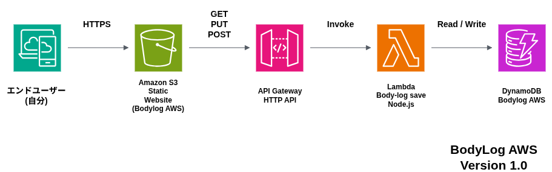

BodyLog AWS

DEMOサイト
http://body-log-aws-console-management.s3-website-ap-northeast-1.amazonaws.com

AWSサーバーレス構成で作成したBodyLogアプリ

使用技術
・HTML
・CSS
・JavaScript
・API Gateway
・AWS Lambda(Node.js)
・DynamoDB
・CloudWatch

機能
・体重記録
・歩数記録
・睡眠時間記録
・食事記録
・メモ
・CRUD(Create Read Update Delete)

アーキテクチャ
Browser
↓
API Gateway
↓
Lambda
↓
DynamoDB

Version 1.0 まで
・AWSサーバレスCRUDアプリ完成
・S3
・API Gateway
・Lambda(Node.js)
・DynamoDB
・CloudWatch

Version 1.1 まで
・編集モード追加
・更新ボタン切り替え
・フォーム自動リセット
・保存後一覧自動更新
・画面スクロール改善
・体重推移グラフ追加
・Chart.js導入

docs/